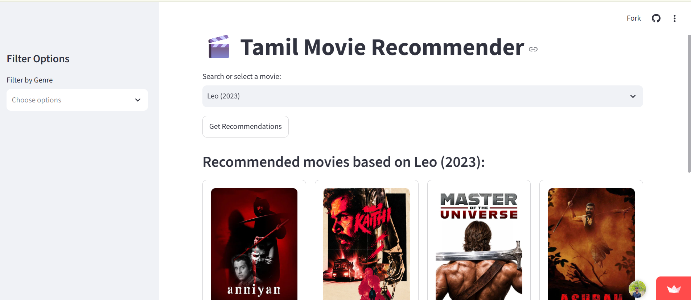

# 🎬 Tamil Movie Recommendation System

A Python-based web application that recommends Tamil movies based on movie and rating data.

## 📌 Project Overview

The Tamil Movie Recommendation System is designed to help users discover Tamil movies through a simple and interactive recommendation interface.

The project demonstrates practical implementation of Python, data processing, recommendation techniques, and web application deployment.

## 🚀 Live Application

Try the application here:

https://tamil-movie-recommender-indhuraj.streamlit.app/

## 🖥️ Application Preview

## 🛠️ Technologies Used

- Python
- Pandas
- Scikit-learn
- Streamlit

## 📂 Project Files

- `app.py` - Main Streamlit application
- `movies.csv` - Movie dataset
- `ratings.csv` - Movie ratings dataset
- `requirements.txt` - Required Python libraries

## ✨ Features

- Interactive movie selection
- Tamil movie recommendations
- Movie and rating data processing
- Simple Streamlit user interface
- Deployed as a web application

## ▶️ Run the Project Locally

Clone the repository:

git clone https://github.com/Indhuraj-DataEngineering/tamil-movie-recommender.git

Install the required libraries:

pip install -r requirements.txt

Run the Streamlit application:

streamlit run app.py

## 👨‍💻 Author

**Indhuraj L**

Data Science & AI Learner

GitHub: https://github.com/Indhuraj-DataEngineering
